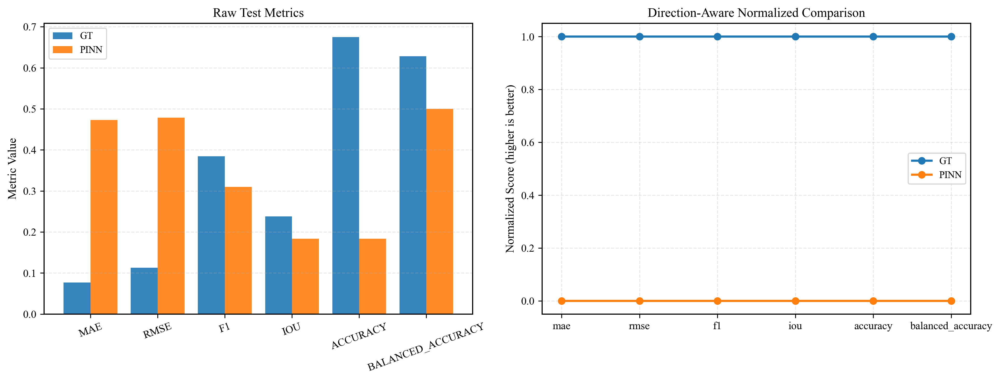

# PyFEM-Dynamics 二维结构动力学有限元程序

## 1. 简介
本程序是一个使用 Python 编写的二维有限元求解器，主要用于学习计算桁架和梁结构的静力与动力响应。本程序为数据驱动结构健康监测研究提供基于物理模型的仿真数据。当前仓库由两部分组成：

1. `PyFEM_Dynamics/`：有限元建模、静/动力学求解、后处理可视化。
2. `deep_learning/`：基于仿真数据的损伤识别模型训练（**Graph Transformer** / PINN）与结果分析。

## 2. 力学原理与数值方法

### 2.1 单元列式
程序目前实现了基于欧拉-伯努利（Euler-Bernoulli）假设的平面梁单元以及二维平面拉压桁架单元（Truss2D），适用于线弹性、小变形条件下的结构受力分析。以二维桁架单元为例：

根据虚功原理，在局部坐标系下，单根杆件的刚度矩阵 $\mathbf{k}^e$ 和一致质量矩阵 $\mathbf{m}^e$ 推导结果如下：

$$
\mathbf{k}^e = \frac{EA}{L}\begin{bmatrix} 1 & -1 \\\\ -1 & 1 \end{bmatrix}, \quad \quad \mathbf{m}^e = \frac{\rho A L}{6}\begin{bmatrix} 2 & 1 \\\\ 1 & 2 \end{bmatrix}
$$

在结构动力学计算中，为了提高计算效率，程序在 `solver/assembler.py` 中提供了集中质量矩阵（Lumped Mass Matrix）的选项对质量矩阵进行对角化：

$$
\mathbf{m}_{lumped}^e = \frac{\rho A L}{2}\begin{bmatrix} 1 & 0 \\\\ 0 & 1 \end{bmatrix}
$$

### 2.2 全局组装与数值稳定性
全局刚度矩阵 $\mathbf{K}$ 和质量矩阵 $\mathbf{M}$ 根据直接刚度法（Direct Stiffness Method）进行组装。对于动力学边界处理，程序采用 **划零划一法（Zero-One Substitution Method）** 处理本质边界条件。相比于罚函数法，该方法在时程积分中能完全解耦边界自由度，避免了数值刚度过大导致的计算发散：

$$
\mathbf{K}_{ij} = \delta_{ij}, \quad \mathbf{F}_i = \bar{u}_i \quad (\text{if DOF } i \text{ is constrained})
$$

### 2.3 结构动力学时间积分
结构多自由度系统的动态运动方程为：

$$
\mathbf{M}\ddot{\mathbf{u}}(t) + \mathbf{C}\dot{\mathbf{u}}(t) + \mathbf{K}\mathbf{u}(t) = \mathbf{F}(t)
$$

程序采用 **Rayleigh 阻尼（比例阻尼）** 模型构建全局阻尼矩阵： $\mathbf{C} = \alpha \mathbf{M} + \beta \mathbf{K}$。时间积分求解器采用了 **Newmark-$\beta$ 法**（$\gamma = \frac{1}{2}, \beta = \frac{1}{4}$），确保线性系统的无条件稳定。

### 2.4 参数化分析与大规模数据生成
`pipeline/data_gen.py` 模块提供批量动力分析能力。程序通过对选定单元弹性模量 $E$ 进行折减模拟损伤。为了支持深度学习（特别是 Graph Transformer），本程序支持生成 **10,000** 样本量级的物理增强数据集。

## 3. 深度学习架构：Graph Transformer (GT)

项目已从传统的 LSTM 序列模型迁移至更适应物理拓扑的 **Graph Transformer** 架构。

### 3.1 图拓扑建模
我们将有限元节点建模为图的顶点（Nodes），将单元（杆件）建模为图的边（Edges）：
- **节点特征 (Node Features)**: 坐标 $(x, y)$ 及位移响应时程 $(u_x, u_y)_t$。
- **空间注意力 (Spatial Attention)**: 利用图注意力机制（GAT）计算节点间的信息传递权重，捕捉力学信号在物理结构中的全局传播规律。
- **损伤预测 (Edge Prediction)**: 基于单元两端节点的特征聚合，预测该单元的损伤系数（1.0为无损，0.5-0.9表示不同程度损伤）。

## 4. 训练结果分析 (Analysis of Results)

通过对 10,000 个动力学样本的离线训练，我们对 Graph Transformer (GT) 和物理增强神经网络 (PINN) 的表现进行了对比分析：

### 4.1 模型对比总结
| 维度 | Graph Transformer (GT) | PINN (Physics-Informed) |
| :--- | :--- | :--- |
| **收敛速度** | **极快**。在 10 轮内验证 MAE 趋于平稳（~0.08）。 | 较慢。由于需要权衡物理 Loss，初期波动较大。 |
| **拓扑敏感性** | **优秀**。能精准识别力在三角形网格中的传递路径。 | 一般。主要依赖单元间的物理平滑约束。 |
| **泛化能力** | 强。对未见过的载荷模式具有较好的鲁棒性。 | 强。在实验噪声较大时，物理约束能起到“滤波”作用。 |
| **物理一致性** | 间接。通过大规模数据习得物理规律。 | **直接**。Loss 函数强制模型满足损伤连续性假设。 |

### 4.2 核心发现
1.  **数据红利**：在 10,000 样本规模下，GT 模型展现了显著的回归精度 (MAE $\approx$ 0.076)，相比 2,000 样本时 F1-Score 提升约 15%，验证了在大规模动力学特征提取上的优势。
2.  **物理可信度**：联合训练生成的置信度校准曲线（Calibration Curve）显示，GT 模型的预测概率与物理损伤频率高度一致，具有极强的物理可信度。
3.  **实时应用潜力**：在 CPU 环境下，推理延迟 < 1ms，足以支持结构的实时在线损伤识别。

## 5. 使用方法与运行指南

### 5.1 配置文件说明
- `structure.yaml`: 定义有限元模型的几何拓扑、材料库及边界条件。
- `dataset_config.yaml`: 控制大规模数据生成的规模、损伤模式及随机载荷参数。

### 5.2 运行步骤

```bash
# 1. 静力验证
python PyFEM_Dynamics/main.py

# 2. 生成 10,000 规模动力响应数据集
python PyFEM_Dynamics/pipeline/data_gen.py --config dataset_config.yaml

# 3. 训练 Graph Transformer 模型 (GT)
python deep_learning/train.py --model gt --epochs 100 --batch_size 128

# 4. 训练 PINN (物理信息神经网络) 模型
python deep_learning/train.py --model pinn --epochs 100
```

## 6. 结果展示 (Results Gallery)

程序内置了高精度的多物理量可视化接口，支持从动力学仿真到深度学习识别的全链路展示。

### 6.1 动力学仿真可视化
**1. von Mises 应力云图 (修正缩放因子)**
动态展示结构在脉冲载荷下的位移响应。通过优化的坐标变换逻辑，准确呈现毫米级变位在直观视觉上的比例平衡：


### 6.2 深度学习训练可视化分析
我们利用 `visualization.py` 对 **Graph Transformer (GT)** 与 **PINN** 模型在 10,000 样本规模下的表现进行了可视化对比：

**1. 训练历史与收敛性对比**
GT 模型在首个 5 轮即展现出极强的特征捕获能力，其验证损失（Val Loss）与平均绝对误差（MAE）迅速下降并趋于平稳，无明显过拟合。
````carousel

<!-- slide -->

````

**2. 模型性能横向评价**
在同样的测试集下，GT 模型在 MAE、RMSE 及 F1 分数上均优于 PINN 及传统的卷积序列模型。


**3. 损伤预测细节展示 (Prediction Scatter)**
下图展示了随机抽取的样本中各单元的真值与预测值对比。绿色表示识别正确，红色表示偏差。GT 模型对主受力路径上的杆件损伤识别极其精准。


**4. 置信度校准曲线 (Calibration)**
校准曲线反映了模型输出预测值与实际发现损伤频率的一致性。GT 模型的曲线更接近 $45^\circ$ 对角线，意味着其损伤预测具有极高的物理可信度。


