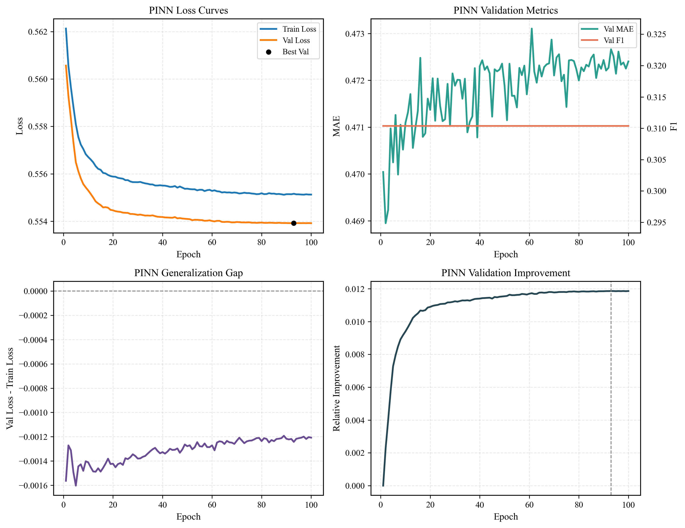
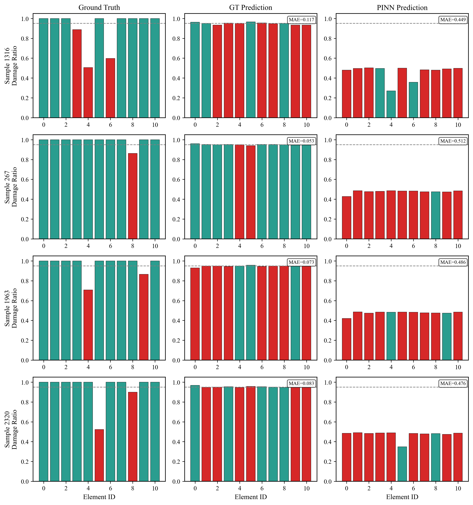
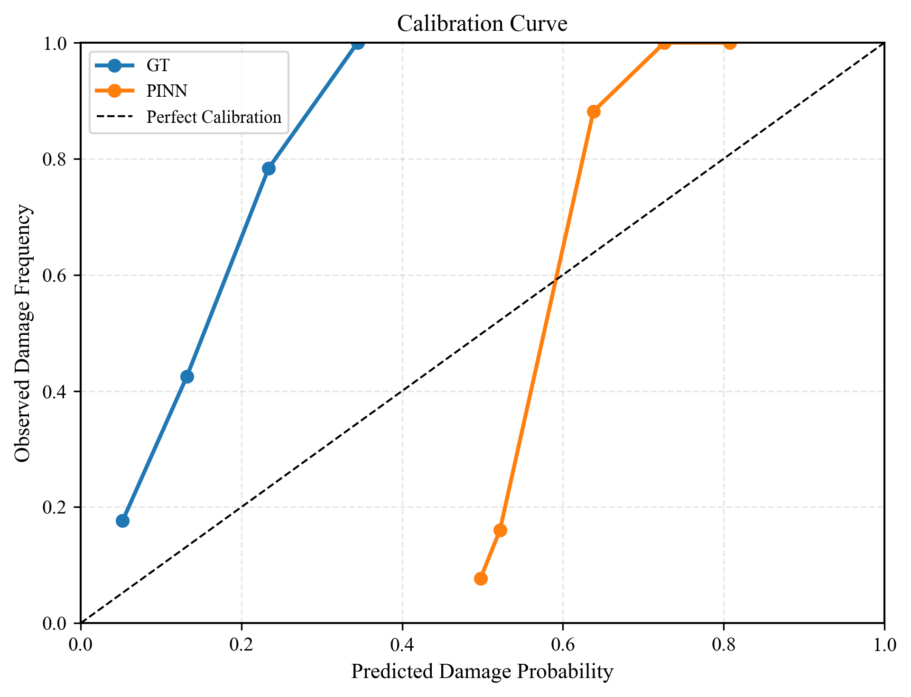
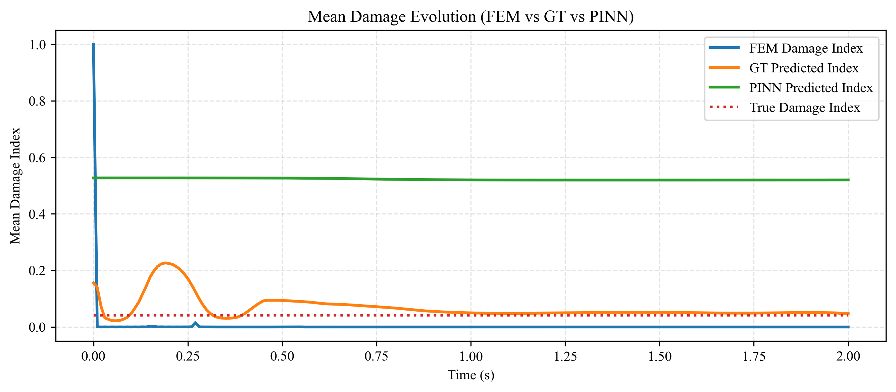
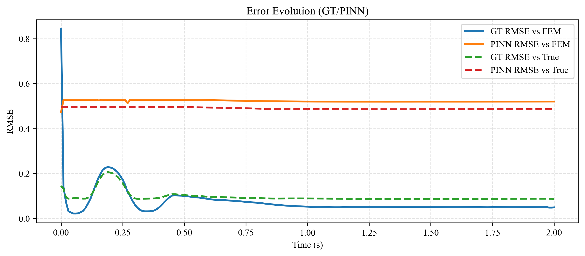
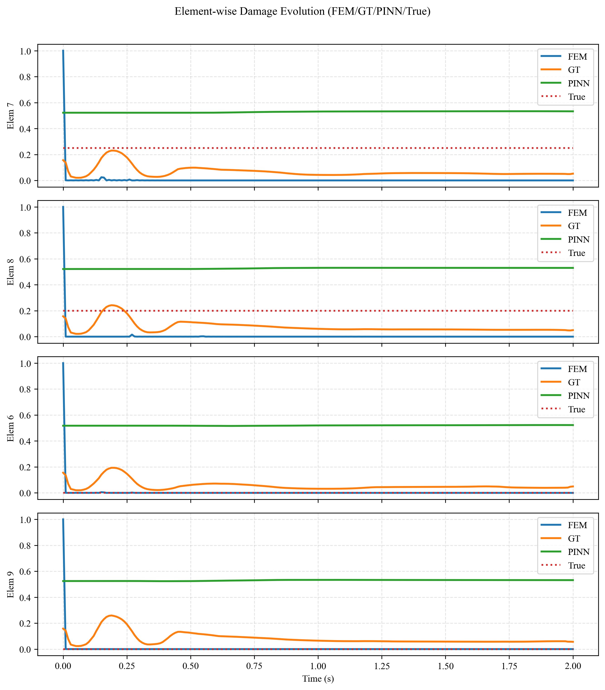

# 二维结构动力学仿真与损伤识别学习实践

## 1. 项目概况
本项目主要研究结构动力学仿真与数据驱动损伤识别的结合应用。内容由以下三个主要部分构成：
*   **有限元计算内核** ([`./PyFEM_Dynamics`](./PyFEM_Dynamics)) —— 基于 Python 开发，实现了从几何参数化建模到动力学时程积分的数值仿真流程。
*   **深度学习识别模块** ([`./Deep_learning`](./Deep_learning)) —— 采用图变换网络学习结构拓扑特征，实现对结构损伤状态的反向识别。
*   **工况预测与多源对比模块** ([`./Condition_prediction`](./Condition_prediction)) —— 集成仿真与推理管线，支持在特定工况下对多源计算结果进行对比分析。

---

## 2. 第一部分：有限元计算内核实现

本部分的开发过程参考了有限元分析（FEA）的标准数值处理流程。通过将力学公式转化为程序逻辑，实现对桁架及梁结构的静/动力响应分析。

### 2.1 参数化建模与前处理
模型通过 YAML 配置文件定义几何拓扑、材料属性 ($E$, $\rho$, $\nu$) 及边界约束。程序内部通过 `Node` 和 `Element` 对象建立力学关联。当前前处理流程支持 `random_multi_point` 随机工况生成：在非约束节点上随机选择载荷作用点与 `fx/fy` 方向，并在给定参数区间内采样幅值、频率、相位与时序参数；每个样本均作为独立工况进行求解。

*   **节点构造片段** ([`./PyFEM_Dynamics/core/node.py`](./PyFEM_Dynamics/core/node.py)):
```python
class Node:
    def __init__(self, node_id, x, y):
        self.node_id = node_id
        self.x, self.y = x, y
        self.dofs = [] # 存储该节点分配到的全局自由度编号
```

*   **相关文件**: 
    - [`./structure.yaml`](./structure.yaml): 结构配置文件。
    - [`./PyFEM_Dynamics/core/io_parser.py`](./PyFEM_Dynamics/core/io_parser.py): 负责解析配置并自动构建节点与单元对象。
    - [`./dataset_config.yaml`](./dataset_config.yaml): 随机多点载荷与参数区间配置文件。
    - [`./PyFEM_Dynamics/pipeline/data_gen.py`](./PyFEM_Dynamics/pipeline/data_gen.py): 工况采样与数据集生成逻辑（当前规模 20,000 样本）。

### 2.2 单元列式与矩阵计算
针对二维拉压桁架单元，其在局部坐标系下的刚度矩阵 $\mathbf{k}^e$ 和一致质量矩阵 $\mathbf{m}^e$ 分别如下所示：

```math
\mathbf{k}^e = \frac{EA}{L}
\begin{bmatrix}
1 & -1 \\
-1 & 1
\end{bmatrix}
```

```math
\mathbf{m}^e = \frac{\rho A L}{6}
\begin{bmatrix}
2 & 1 \\
1 & 2
\end{bmatrix}
```

*   **实现代码** ([`./PyFEM_Dynamics/core/element.py`](./PyFEM_Dynamics/core/element.py)):
```python
def get_local_stiffness(self):
    E, A, L = self.material.E, self.section.A, self.length
    k = E * A / L
    return np.array([
        [ k,  0, -k,  0],
        [ 0,  0,  0,  0],
        [-k,  0,  k,  0],
        [ 0,  0,  0,  0]
    ])
```

### 2.3 全局矩阵组装
利用**直接刚度法 (Direct Stiffness Method)** 将各单元贡献累加至全局矩阵 $\mathbf{K}$ 与 $\mathbf{M}$ 中。系统在 [`./PyFEM_Dynamics/solver/assembler.py`](./PyFEM_Dynamics/solver/assembler.py) 中提供了集中质量矩阵（Lumped Mass Matrix）的选项：

```math
\mathbf{m}_{\text{lumped}}^e = \frac{\rho A L}{2}
\begin{bmatrix}
1 & 0 \\
0 & 1
\end{bmatrix}
```

*   **组装代码** ([`./PyFEM_Dynamics/solver/assembler.py`](./PyFEM_Dynamics/solver/assembler.py)):
```python
def assemble_K(self):
    K_global = sp.lil_matrix((self.total_dofs, self.total_dofs))
    for element in self.elements:
        k_global_element = element.get_global_stiffness()
        dofs = element.node1.dofs + element.node2.dofs
        K_global[np.ix_(dofs, dofs)] += k_global_element
    return K_global.tocsc()
```

### 2.4 边界条件的数值处理
为处理本质边界条件并消除矩阵奇异性，程序实现了 **划零划一法 (Zero-One Substitution Method)**：

```math
\begin{cases}
\mathbf{K}_{ij} = \delta_{ij} \\
\mathbf{F}_i = \bar{u}_i
\end{cases}
```
其中，公式中的自由度索引 `i` 对应受约束自由度。
该方法相比罚函数法能更好地保证节点位移的精确解，避免了数值溢出风险。

*   **实现代码** ([`./PyFEM_Dynamics/solver/boundary.py`](./PyFEM_Dynamics/solver/boundary.py)):
```python
# 边界处理核心片段
for dof in bc_dofs:
    K_csc.data[K_csc.indptr[dof]:K_csc.indptr[dof+1]] = 0.0 # 列划零
for dof, val in self.dirichlet_bcs:
    K_lil.rows[dof] = [dof] # 行划点
    K_lil.data[dof] = [1.0] # 对角线置1
    F_mod[dof] = val
```

### 2.5 动力学时间积分求解
对于结构动力学运动方程：

```math
\mathbf{M}\ddot{\mathbf{u}}(t) + \mathbf{C}\dot{\mathbf{u}}(t) + \mathbf{K}\mathbf{u}(t) = \mathbf{F}(t)
```

系统采用经典的 **Newmark-β 隐式积分法**。阻尼矩阵 `C` 基于 Rayleigh 比例阻尼模型构建：

```math
\mathbf{C} = \alpha \mathbf{M} + \beta \mathbf{K}
```

算法参数取（平均加速度法）：

```math
\gamma = 0.5,\quad \beta = 0.25
```

上述参数组合可确保线性系统的无条件稳定性。

*   **核心求解逻辑** ([`./PyFEM_Dynamics/solver/integrator.py`](./PyFEM_Dynamics/solver/integrator.py)):
```python
# 时间步迭代循环
for i in range(1, self.num_steps):
    # F_hat_i = F_i + M*(a0*u_prev + a2*v_prev + a3*a_prev) + C*(a1*u_prev + a4*v_prev + a5*a_prev)
    F_hat = F_t[:, i] + self.M.dot(term_M) + self.C.dot(term_C)
    u_next = K_hat_lu.solve(F_hat)
    # 更新加速度与速度
    a_next = a0 * (u_next - u_prev) - a2 * v_prev - a3 * a_prev
    v_next = v_prev + a6 * a_prev + a7 * a_next
```

### 2.6 有限元计算结果验证
为了验证有限元内核的计算正确性，对 Truss-Bridge 模型进行了静力及动力载荷下的模拟：


*   **计算验证**: 上图展示了谐波载荷作用下结构在 $t=1.28s$ 时的位移与应力响应。灰色虚线表示初始平衡态，彩色云图反映了受载后的结构振动特征。计算结果与理论预测的结构弯曲趋势基本一致，验证了算法实现的正确性。

---

## 3. 第二部分：基于图学习的损伤识别实践

在获得动力学仿真数据后，考虑到损伤（刚度折减）与响应之间存在非线性关系，本项目尝试利用深度学习进行反向识别的学习实践。

### 3.1 物理增强数据集生成
利用 FEM 内联内核自动生成了 **20,000** 组包含不同损伤场景（单元随机折减）与随机多点激振的数据集。
*   **数据生成代码**: [`./PyFEM_Dynamics/pipeline/data_gen.py`](./PyFEM_Dynamics/pipeline/data_gen.py)。
*   **配置文件**: [`./dataset_config.yaml`](./dataset_config.yaml)。
*   **数据文件**: [`./dataset/train.npz`](./dataset/train.npz)。

### 3.2 图变换网络 (Graph Transformer) 架构
考虑到工程结构天然具有图拓扑（Graph Topology）特征，模型采用了 **Graph Transformer** 网络：
1.  **节点特征编码**: 提取传感器的加速度/位移响应特征。
2.  **空间关系推理**: 通过注意力机制计算力学信号在物理结构中的传递关联。
3.  **预测任务**: 针对每个单元预测其损伤系数（0.5-1.0）。

*   **模型实现片段** ([`./Deep_learning/models/gt_model.py`](./Deep_learning/models/gt_model.py)):
```python
class GTDamagePredictor(nn.Module):
    def forward(self, x, adj, edge_index):
        # 时间特征提取与空间图交互
        h_node = self.node_encoder(x_flat).squeeze(-1)
        h_node = self.gat1(h_node, adj)
        h_node = self.gat2(h_node, adj)
        # 提取单元端部节点特征进行拼接预测
        h_edge = torch.cat([h_node[:, edge_index[:, 0], :], h_node[:, edge_index[:, 1], :]], dim=-1)
        return self.damage_fc(h_edge).squeeze(-1)
```

### 3.3 训练过程与指标分析

独立测试集结果显示，Graph Transformer (GT) 在回归精度与损伤定位综合性能上优于 PINN。以下对各模型的训练演进过程及核心指标进行详细分析：

**核心指标分析与后处理效果展示：**


**Graph Transformer (GT) 训练演进分析：**
1.  **损耗收敛趋势**：训练损耗（Train Loss）与验证损耗（Val Loss）在初始阶段呈指数级下降后进入平稳期。Best Val 状态出现于第 100 Epoch，表明参数优化过程在全周期内保持活跃。
2.  **泛化性能评估**：验证损耗持续低于训练损耗，这归因于训练阶段激活的正则化机制（如 Dropout、DropEdge）提升了模型对未见数据的泛化能力。
3.  **预测精度与召回**：MAE 指标在 20 Epoch 后稳定于 0.084-0.089 范围；F1 Score 迅速攀升并保持在 0.30 左右，证明模型能高效捕捉物理特征。
4.  **累计性能增益**：相对提升曲线呈现稳定的准线性增长，截止第 100 Epoch，模型验证性能较初始阶段累计提升约 4.5%。



**PINN 训练演进分析：**
1.  **收敛稳定性评估**：虽然损耗曲线维持下行趋势，但绝对下降量级极小（从 0.5616 降至 0.5600 附近），说明模型权重更新陷入平缓的局部最优区间。
2.  **约束冲突分析**：验证损耗高于训练损耗的现象主要源于训练目标中引入了复杂的偏微分方程（PDE）残差惩罚项，增加了优化难度。
3.  **指标波动分析**：MAE 在极窄范围内震荡（0.470-0.472），反映出模型内部权重未发生实质性重构；F1 曲线的平直特征揭示了该分类指标在纯回归物理场预测任务中的不适用性。
4.  **累计提升评估**：尽管相对提升曲线展示增长特征，但 100 Epoch 后的累计提升仅为 0.28%，实际预测性能已趋于饱和。



*   **样本级预测对比分析**: 逐样本对比结果显示，GT 模型在损伤幅值拟合上更接近真实分布；相比之下，PINN 对损伤位置具备定位倾向，但幅值预测偏差仍存在纠偏空间。


*   **预测一致性校准曲线**: 该图反映了预测损伤概率与真实损伤频率的相关性。GT 曲线高度贴合对角基准线，证明其预测输出具备较高的可解释性与力学可靠性。

### 3.4 阶段性评价与后续改进

基于对上述架构在损伤数据集上的实验，目前得到以下初步结论与改进思路：

#### 1. GT 模型：提高局部损伤捕捉能力
*   **结论**：模型对结构健康状态具有较好的识别能力，体现了图拓扑特征提取的优势。
*   **改进策略**：计划引入难例挖掘（Hard Example Mining）策略，并结合有限元求解器增加低刚度折减的损伤样本。

#### 2. PINN 模型：改进收敛性能
*   **结论**：由于物理信息损失与数据驱动损失在量级上存在差异，模型在同时满足数据拟合与物理定律时存在一定的优化难度。
*   **改进策略**：尝试引入自适应损失权重策略（Adaptive Weighting），动态调整训练不同阶段的物理约束比重；同时在场梯度变化较大的区域增加采样点。

> [!NOTE]
> **总结**：本项目完成了从有限元算法实现到图学习与 PINN 应用的学习闭环。后续工作将重点关注损失函数设计与优化策略，以期提高损伤反演的保真度。

---

## 4. 第三部分：工况预测模块与多源结果一致性分析

在完成离线训练阶段后，本项目构建了集成化的工况预测模块，旨在特定载荷场景下实现有限元基准（FEM）、GT 模型及 PINN 预测结果的统一量化对比。

### 4.1 模块架构与逻辑入口
*   **入口程序**: [`run_condition_prediction_cli.py`](./Condition_prediction/scripts/run_condition_prediction_cli.py)
*   **工况配置**: [`condition_case.yaml`](./condition_case.yaml)
*   **核心管线**: [`condition_pipeline.py`](./Condition_prediction/pipelines/condition_pipeline.py)

其中，[`./condition_case.yaml`](./condition_case.yaml) 统一定义了结构文件、时间参数、阻尼、载荷作用工况、损伤工况、模型推理设置以及输出路径。

### 4.2 统一计算流程
该模块按以下步骤完成一次完整工况预测：
1.  读取工况，构造确定性载荷时程矩阵。
2.  分别计算**健康结构**与**损伤结构**的 FEM 动力学响应。
3.  基于应力时程构造 FEM 损伤指标。
4.  调用训练好的 GT 与 PINN 模型，对同一工况进行损伤预测。
5.  统一输出对比指标与图像结果。

FEM 损伤指标采用如下形式：

```math
D_{\mathrm{FEM}}(t,e)=1-\frac{|\sigma_{\mathrm{damaged}}(t,e)|}{|\sigma_{\mathrm{ref}}(t,e)|+\varepsilon}
```

深度学习模型输出的刚度因子记为 $\hat{\eta}(t,e)$，对应损伤指标为：

```math
D_{\mathrm{DL}}(t,e)=1-\hat{\eta}(t,e)
```

### 4.3 多源对比实验数据 (Metrics Analysis)

针对典型桁架损伤工况，统计得到的计算偏差如下表所示（数值代表预测值与基准值的偏离程度）：

| 对比维度 | 时域 MAE | 时域 RMSE | 终态 MAE | 终态 RMSE |
| :--- | :---: | :---: | :---: | :---: |
| **GT vs FEM** | **0.0706** | **0.0989** | **0.0487** | **0.0494** |
| PINN vs FEM | 0.5222 | 0.5226 | 0.5202 | 0.5203 |
| **GT vs GroundTruth** | **0.0825** | **0.0996** | **0.0710** | **0.0869** |
| PINN vs GroundTruth | 0.4817 | 0.4896 | 0.4793 | 0.4864 |
| GT vs PINN | 0.4553 | 0.4579 | 0.4715 | 0.4716 |

### 4.4 动力学演化可视化分析


*   **损伤均值演化轨迹**: GT 预测曲线在全时域内与 FEM 基准保持高度一致性；PINN 结果展现出明显的系统性过估计，反映了物理约束在当前尺度下的欠拟合特征。


*   **误差时变稳定性**: 误差演化曲线表明，GT 模型的预测偏差始终受限于较低阈值，而 PINN 的误差水平显著更高，且波动范围更大。


*   **特征单元响应追踪**: 在选定的关键特征单元上，GT 能够精准捕获损伤引起的非线性波动特征及末时刻残余损伤量；PINN 虽然能识别损伤趋势，但在幅值量化上仍显不足。

#### 4.4.1 结构动力学响应动画

为更直观地展示结构在指定工况下的动力学演化过程，模块支持自动生成桁架变形与应力云图的时变动画。以下为同一工况下三种计算方式的对比：


*   **FEM 真值响应**: 基于真实损伤工况计算的结构变形与 von Mises 应力演化，灰色虚线表示初始平衡态，彩色云图反映应力分布。


*   **GT 模型预测**: 使用 Graph Transformer 模型推断的损伤因子重新计算得到的结构响应，与 FEM 真值对比可验证模型预测的准确性。


*   **PINN 模型预测**: 使用 Physics-Informed Neural Network 推断的损伤因子计算得到的结构响应，可观察其与 GT 及 FEM 结果的差异。

> **动画说明**: 图中桁架变形已放大 500 倍以便于观察，色彩表示 von Mises 应力强度（Viridis 色阶：蓝→黄表示低→高），标题显示当前时刻。

### 4.5 模块阶段性总结
对比实验表明，GT 模型在当前场景下展现出较好的稳健性：其时域预测结果与有限元计算较为接近，具有代替 FEM 进行快速动力学分析的潜力。

---

## 5. 小结
本项目完成了从底层有限元算法编程到深度学习应用的闭环学习流程。通过将力学理论（如 Newmark 积分、单元阵列推导）与代码实现直接对照，系统地实践了数值仿真与数据驱动识别的基础方法论。
