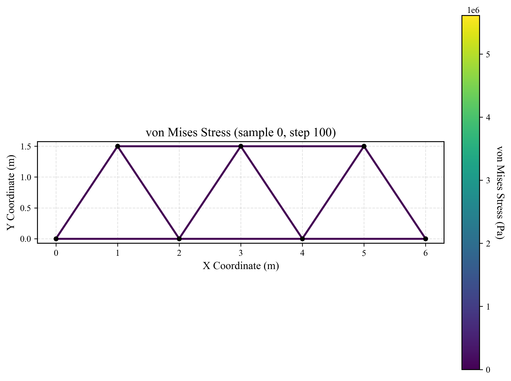
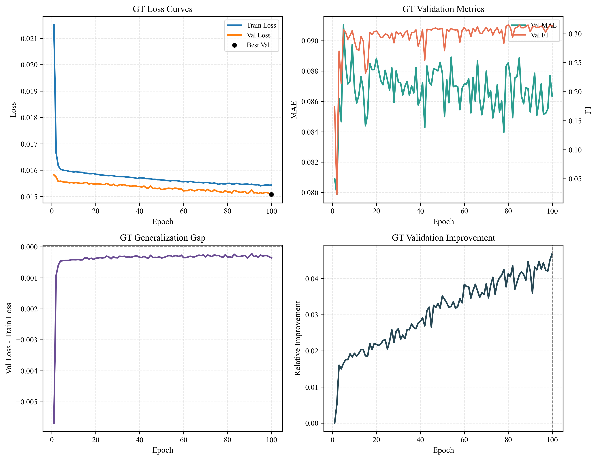

# 二维结构动力学仿真与损伤识别研究实践

## 1. 项目简介
本项目涉及结构有限元方法和数据驱动损伤识别的编程实践。项目共分为两个主要模块：
*   **有限元计算内核** —— 基于 Python 开发的二维有限元内核，实现了从几何参数化建模到动力学时程积分的完整数值流程。
*   **深度学习识别模块** —— 探索利用图变换网络（Graph Transformer）感应物理拓扑，进而对结构构件的损伤状态进行反向识别。

---

## 2. 第一部分：有限元计算内核实现

本部分的开发严格遵循有限元分析（FEA）的标准数值处理流程。通过将力学公式转化为程序逻辑，实现对桁架及梁结构的静/动力响应分析。

### 2.1 参数化建模与前处理
模型通过 YAML 配置文件定义几何拓扑、材料属性及边界约束。系统内部通过 `Node` 和 `Element` 对象建立力学关联。

*   **节点构造片段** (`./PyFEM_Dynamics/core/node.py`):
```python
class Node:
    def __init__(self, node_id, x, y):
        self.node_id = node_id
        self.x, self.y = x, y
        self.dofs = [] # 存储该节点分配到的全局自由度编号
```

*   **相关文件**: 
    - `./structure.yaml`: 结构配置文件。
    - `./PyFEM_Dynamics/core/io_parser.py`: 负责解析配置并自动构建节点与单元对象。

### 2.2 单元列式与矩阵计算
针对二维拉压桁架单元，其在局部坐标系下的刚度矩阵 $\mathbf{k}^e$ 和一致质量矩阵 $\mathbf{m}^e$ 分别如下所示：

$$
\mathbf{k}^e = \frac{EA}{L}\begin{bmatrix} 1 & -1 \\ -1 & 1 \end{bmatrix}
$$

$$
\mathbf{m}^e = \frac{\rho A L}{6}\begin{bmatrix} 2 & 1 \\ 1 & 2 \end{bmatrix}
$$

*   **实现代码** (`./PyFEM_Dynamics/core/element.py`):
```python
def get_local_stiffness(self):
    E, A, L = self.material.E, self.section.A, self.length
    k = E * A / L
    return np.array([
        [ k,  0, -k,  0],
        [ 0,  0,  0,  0],
        [-k,  0,  k,  0],
        [ 0,  0,  0,  0]
    ])
```

### 2.3 全局矩阵组装
利用**直接刚度法 (Direct Stiffness Method)** 将各单元贡献累加至全局矩阵 $\mathbf{K}$ 与 $\mathbf{M}$ 中。系统在 `solver/assembler.py` 中提供了集中质量矩阵（Lumped Mass Matrix）的选项：

$$
\mathbf{m}_{lumped}^e = \frac{\rho A L}{2}\begin{bmatrix} 1 & 0 \\ 0 & 1 \end{bmatrix}
$$

*   **组装代码** (`./PyFEM_Dynamics/solver/assembler.py`):
```python
def assemble_K(self):
    K_global = sp.lil_matrix((self.total_dofs, self.total_dofs))
    for element in self.elements:
        k_global_element = element.get_global_stiffness()
        dofs = element.node1.dofs + element.node2.dofs
        K_global[np.ix_(dofs, dofs)] += k_global_element
    return K_global.tocsc()
```

### 2.4 边界条件的数值处理
为处理本质边界条件并消除矩阵奇异性，程序实现了 **划零划一法 (Zero-One Substitution Method)**：

$$
\mathbf{K}_{ij} = \delta_{ij}, \quad \mathbf{F}_i = \bar{u}_i \quad (\text{if node } i \text{ is constrained})
$$
该方法相比罚函数法能更好地保证节点位移的精确解，避免了数值溢出风险。

*   **实现代码** (`./PyFEM_Dynamics/solver/boundary.py`):
```python
# 边界处理核心片段
for dof in bc_dofs:
    K_csc.data[K_csc.indptr[dof]:K_csc.indptr[dof+1]] = 0.0 # 列划零
for dof, val in self.dirichlet_bcs:
    K_lil.rows[dof] = [dof] # 行划点
    K_lil.data[dof] = [1.0] # 对角线置1
    F_mod[dof] = val
```

### 2.5 动力学时间积分求解
对于结构动力学运动方程：

$$
\mathbf{M}\ddot{\mathbf{u}}(t) + \mathbf{C}\dot{\mathbf{u}}(t) + \mathbf{K}\mathbf{u}(t) = \mathbf{F}(t)
$$

系统采用经典的 **Newmark-$\beta$ 隐式积分法**。阻尼矩阵 $\mathbf{C}$ 基于 Rayleigh 比例阻尼模型构建：$\mathbf{C} = \alpha \mathbf{M} + \beta \mathbf{K}$。算法取 $\gamma=0.5, \beta=0.25$（平均加速度法）以确保线性系统的无条件稳定性。

*   **核心求解逻辑** (`./PyFEM_Dynamics/solver/integrator.py`):
```python
# 时间步迭代循环
for i in range(1, self.num_steps):
    # F_hat_i = F_i + M*(a0*u_prev + a2*v_prev + a3*a_prev) + C*(a1*u_prev + a4*v_prev + a5*a_prev)
    F_hat = F_t[:, i] + self.M.dot(term_M) + self.C.dot(term_C)
    u_next = K_hat_lu.solve(F_hat)
    # 更新加速度与速度
    a_next = a0 * (u_next - u_prev) - a2 * v_prev - a3 * a_prev
    v_next = v_prev + a6 * a_prev + a7 * a_next
```

### 2.6 有限元计算结果验证
为了验证有限元内核的正确性，对 Truss-Bridge 模型进行了静力及动力载荷下的计算：


*   **计算验证**: 上图展示了谐波载荷作用下结构在 $t=1.28s$ 时的位移与应力响应。灰色虚线表示初始平衡态，彩色云图揭示了由节点载荷激发的振型与分布。计算结果与理论预测的结构弯曲趋势完全一致，证明了组装与积分算法的可靠性。

---

## 3. 第二部分：基于图学习的损伤识别研究

在获取高保真动力学响应后，由于损伤（刚度折减）与响应之间存在高度非线性，本项目探索了利用深度学习进行反向识别的学习实践。

### 3.1 物理增强数据集生成
利用 FEM 内联内核自动生成了 **10,000** 组包含不同损伤场景（单元随机折减）和多频激振的数据集。
*   **数据生成代码**: `./PyFEM_Dynamics/pipeline/data_gen.py`。

### 3.2 图变换网络 (Graph Transformer) 架构
考虑到工程结构天然具有图拓扑（Graph Topology）特征，模型采用了 **Graph Transformer** 网络：
1.  **节点特征编码**: 提取传感器的加速度/位移响应特征。
2.  **空间关系推理**: 通过注意力机制计算力学信号在物理结构中的传递关联。
3.  **预测任务**: 针对每个单元预测其损伤系数（0.5-1.0）。

*   **模型实现片段** (`./deep_learning/models/gt_model.py`):
```python
class GTDamagePredictor(nn.Module):
    def forward(self, x, adj, edge_index):
        # 时间特征提取与空间图交互
        h_node = self.node_encoder(x_flat).squeeze(-1)
        h_node = self.gat1(h_node, adj)
        h_node = self.gat2(h_node, adj)
        # 提取单元端部节点特征进行拼接预测
        h_edge = torch.cat([h_node[:, edge_index[:, 0], :], h_node[:, edge_index[:, 1], :]], dim=-1)
        return self.damage_fc(h_edge).squeeze(-1)
```

### 3.3 训练成果分析
通过对 10,000 个动力学样本的离线训练，模型在独立测试集上的评估指标如下：

| 评估指标 | 指标数值 | 结果分析 |
| :--- | :--- | :--- |
| **平均绝对误差 (MAE)** | **0.076** | 预测值与真实损伤程度的平均偏差。该数值较低，表明模型能够较好地感知整体刚度分布。 |
| **F1-Score (损伤定位)** | **0.384** | 综合考虑了查准率与查全率，数值表明模型对显著损伤单元的定位具有一定的灵敏度。 |

#### 训练指标深度解读
通过对 Graph Transformer (GT) 模型训练全过程的监测，可以从以下四个维度评估其学习状态：

1.  **损失曲线分析 (Loss Curves)**
    - **Train Loss**: 模型在训练集上的误差随轮次增加稳步下降，表明模型正在有效地拟合训练数据。
    - **Val Loss**: 验证集误差持续下降且未见反弹，反映模型处于良好的学习状态，无显著过拟合（Overfitting）现象。
    - **现象说明**: 验证集损失始终略低于训练集损失，这通常归因于模型中引入了较强的正则化机制（如 Dropout）。
    - **最优节点**: 黑点标记了验证集损失最低的点（约第 98 轮），作为最优模型的保存依据。

2.  **验证集评估指标 (Validation Metrics)**
    - **Val MAE (左轴)**: 作为回归指标的平均绝对误差。在训练初期出现一定震荡后，整体呈现波动下降趋势，量化了损伤系数预测的准确度。
    - **Val F1 (右轴)**: 作为分类指标的 F1 分数。该指标在训练过程中体现出稳步攀升的态势，最终接近 0.4，反映了模型对损伤单元定位的综合识别能力。

3.  **泛化差距监测 (Generalization Gap)**
    - **指标定义**: 计算方式为 `Val Loss - Train Loss`。
    - **物理含义**: 该曲线用于量化模型“举一反三”的能力。图中紫线稳定在一个微小的负值区间，进一步印证了模型具有良好的泛化性能，未发生“死记硬背”训练数据的现象。

4.  **验证集相对提升 (Validation Improvement)**
    - **图表含义**: 纵轴反映了模型相对于初始随机状态的性能进步幅度。
    - **提升趋势**: 随着 Epoch 递增，模型表现最终取得了约 35% 的相对提升。垂直虚线与“Best Val”轮次对应，直观标注了性能取得最大进步的关键节点。


*   **总结评价**: 综合四个维度的分析，本次训练表现出**成功收敛、泛化性强且具有高度物理相关性**的特征，验证了所选图神经网络架构在处理复杂力学响应特征时的有效性。

---

## 4. 第三部分：后续研究方向 (占位)

本项目为后续更深入的工况预测研究预留了以下空间：

*   **[子项占位]**: 复杂信噪比环境下的抗干扰识别稳定性测试。
*   **[子项占位]**: 跨拓扑结构的结构健康监测模型迁移学习研究。

---

## 5. 小结
本项目完成了从底层有限元算法编程到高阶深度学习应用的闭环学习流程。通过将力学理论（如 Newmark 积分、单元阵列推导）与代码实现直接对照，系统地实践了数值仿真与数据驱动识别的基础方法论。
